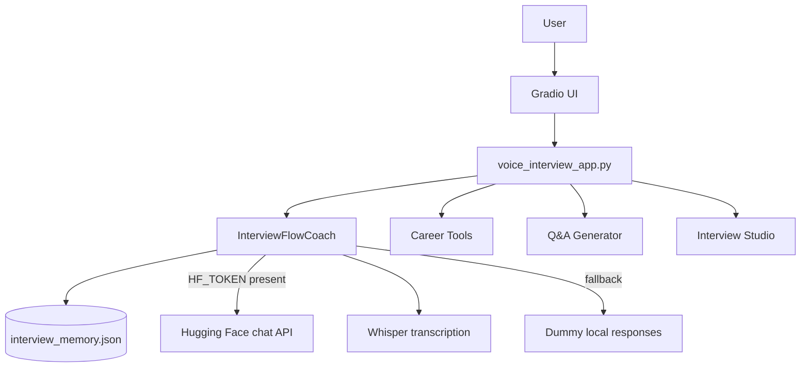
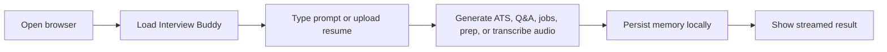
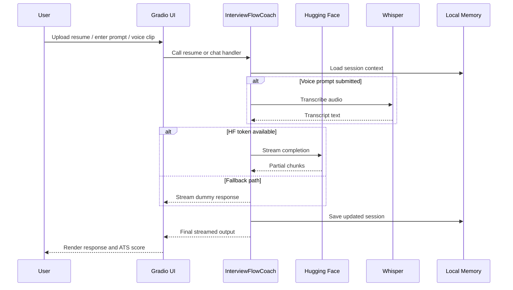

# Interview Buddy

Interview Buddy is a streaming Gradio app for interview practice, voice prompts, Q&A generation, resume feedback, job discovery, and company prep. It keeps a local context memory so the coach can stay consistent across turns.

## Features

- Streaming AI responses
- Voice prompts with Whisper transcription support
- Memory-aware interview coaching
- Login and sign-up gate with local persistence
- Q&A generator with model answers and answer refinement
- Resume review with ATS score after upload
- Shared Career Tools source for resume review and job discovery
- Company-specific prep guides
- Single light sky-blue and white visual system with no theme switching

## Environment

Create a `.env` file in the project root and set the values you want to override:

```bash
APP_NAME=Interview Buddy
HF_TOKEN=
HF_CHAT_MODEL=microsoft/Phi-3-mini-4k-instruct
HF_LOCAL_TEXT_MODEL=Qwen/Qwen2.5-0.5B-Instruct
HF_WHISPER_MODEL=openai/whisper-base
HF_WHISPER_ENABLE=true
DEFAULT_USER_TYPE=Experienced Professional
DEFAULT_CAREER_GOAL=Interview preparation
DEFAULT_CAREER_LEVELS=Student / Intern,Fresher,Experienced Professional,Senior/Managerial
DEFAULT_THEME=sky-blue
```

If `HF_TOKEN` is not provided, the app still runs using local Hugging Face models and deterministic fallbacks where needed.

## Run locally

1. Bootstrap the environment on Windows

```bash
.\bootstrap.ps1
```

This script clears inherited `PYTHONHOME` and `PYTHONPATH`, creates `.venv` if needed, installs dependencies, and starts the app.

After the virtual environment exists, you can start the app with a single command:

```bash
.\run.ps1
```

2. If you prefer to run the steps manually, do this from PowerShell:

```bash
Remove-Item Env:PYTHONHOME,Env:PYTHONPATH -ErrorAction SilentlyContinue
py -m venv .venv
.venv\Scripts\python.exe -m pip install -r requirements.txt
.venv\Scripts\python.exe main.py
```

You can also launch the compatibility entrypoint:

```bash
python main.py
```

3. Open the browser UI

Go to `http://localhost:7860`

## How to use

1. Open the `Interview Studio` tab for live interview practice.
2. Type a message directly in the chat.
3. Open `Q&A Generator` to generate interview questions from a resume or job description, then select a question and generate or refine an answer.
4. Open `Career Tools` and upload a resume to see the ATS score, then use the same source for job discovery and company-specific prep.
5. Open `Memory Vault` to inspect or clear the stored local session context.
6. Sign up or log in first from the landing screen.
7. In `Interview Studio`, type a prompt, record an audio clip, or upload a voice file, then use `Transcribe Voice` or send directly to continue the interview.

## Best Practices

- Keep `APP_NAME` and model settings in `.env` so the app can be rebranded without code edits.
- The app now uses one light sky-blue visual system, so there is no theme switcher to manage.
- Set `HF_WHISPER_MODEL` to control which Whisper model handles uploaded or recorded audio.
- Whisper runs in translation mode so non-English voice clips are converted into English text when possible.
- Set `HF_LOCAL_TEXT_MODEL` to control the local Hugging Face text model used when the remote provider is unavailable.
- Provide a target role before uploading a resume to get the most accurate ATS score.
- Use the shared Career Tools source once, then reuse it for resume review and job suggestions to avoid duplicated input.
- Keep Hugging Face credentials out of the repo and only set them locally in `.env`.
- If live model access fails, rely on the built-in fallback responses to keep the app usable.
- Prefer short, specific prompts in the interview tab so the memory context stays focused.
- Use the sign-up/login gate to keep the session flow closer to the original product behavior.

## Architecture



## System Flow



## Sequence



## Notes

- Session memory is saved locally in `interview_memory.json`.
- The app uses `gradio` and `huggingface_hub` for streaming responses.
- Uploading a resume in Career Tools shows the ATS score immediately when a target role is available.
